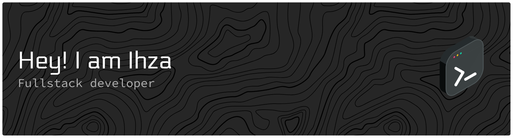

<h1>
  
</h1>

---

## 👨‍💻 About Me

I'm a **Full Stack Developer** from Pontianak, Indonesia, specializing in modern web technologies and e-commerce solutions. I build scalable, user-centric applications that solve real business problems.

- 🔭 Currently working on: **Dua Insan Story** - A hybrid e-commerce platform for digital & print invitations
- 🔭 Currently working on: **Toko Komputer** - A Professional Landing Page for Local Computer Store in Pontianak
- 💼 **Open to:** Freelance projects, Full-time opportunities, and Collaborations
- 📍 Based in: Pontianak, Indonesia 🇮🇩
- ⚡ Passionate about: Building performant web applications with excellent UX

---

## 🚀 Featured Projects

### 📧 Dua Insan Story - Hybrid E-Commerce Platform

> **Platform Undangan Cetak dan Digital Terbaik di Pontianak**  
> A comprehensive hybrid e-commerce solution for digital and print wedding invitations

#### 🎯 Problem & Solution

**Problem:** Traditional invitation businesses struggle to manage both digital and physical product sales with automated digital activation, payment processing, and order management.

**Solution:** A fully integrated platform with three separate applications working seamlessly together - REST API Backend for centralized business logic, Admin Dashboard for efficient management, and Customer Website for seamless shopping experience.

#### 🌐 Live Demo & Repositories

| Application | Live Demo | Repository |
|------------|-----------|------------|
| 👥 **User Site** | [duainsanstory.eproject.tech](https://duainsanstory.eproject.tech) | [View Code](https://github.com/ihza6661/duainsan.story-user-site.git) |
| 🛠️ **Admin Panel** | [admin.duainsanstory.eproject.tech](https://admin.duainsanstory.eproject.tech) | [View Code](https://github.com/ihza6661/dua_insan_story_admin.git) |
| ⚙️ **REST API** | Private | [View Code](https://github.com/ihza6661/dua_insan_story.git) |

#### ✨ Key Features

- 🛒 **Hybrid E-commerce** - Physical & digital products with automatic activation after payment
- 💳 **Payment Gateway** - Midtrans integration (15+ methods), down payment system (30% DP)
- 📧 **Digital Invitation System** - 12-month validity, dynamic form builder, automatic activation
- 🎨 **Design Proof Workflow** - Customer review system (Approve/Revision/Reject)
- 📦 **Order Management** - 13 automated statuses, cancellation system with refunds
- ⭐ **Review & Rating** - 5-star system with photo uploads, moderation
- 🔔 **Notification System** - 12 email templates, Laravel Queues for async processing
- 📊 **Admin Analytics** - Revenue tracking, order distribution, low stock alerts

#### 🛠️ Tech Stack

**Backend:** Laravel 12 + PHP 8.2 + MySQL + Redis + AWS S3  
**Admin Dashboard:** Next.js 15 + React 19 + TypeScript + TanStack Query + Zustand  
**User Site:** Vite 5 + React 18 + TypeScript + Framer Motion  
**Styling:** Tailwind CSS v3/v4 + shadcn/ui  
**Integrations:** Midtrans (Payment), RajaOngkir (Shipping), SendGrid (Email)

#### 📈 Project Scale

- 🗄️ **55 database tables** with comprehensive relationships
- 📝 **3,540+ lines** of service layer code
- 🧪 **20+ feature tests** with 118+ assertions
- 🎨 **180+ components** across admin and user sites
- 🔄 **150+ RESTful API endpoints**

---

### 🖥️ Database Computer - Landing Page

A modern, conversion-optimized landing page for a trusted computer store in Pontianak, West Kalimantan

#### 💼 Business Impact

- ✅ **24/7 customer self-service** reducing support workload by 70%
- ✅ **SEO-optimized** with Schema.org markup for Google visibility
- ✅ **Smart WhatsApp routing** (Sales/Service) with conversion tracking
- ✅ **Projected ROI:** 1,500% (75-100 WhatsApp inquiries/month)

#### ✨ Key Features

- 🛒 **Dynamic product catalog** with sold-out tracking and real-time inventory
- 📊 **Built-in analytics dashboard** - GA4 + Facebook Pixel integration
- 💬 **Context-aware WhatsApp integration** - Automatic routing based on inquiry type
- ⚡ **Lighthouse scores:** 90+ performance, 100 SEO, 95+ accessibility
- 🔍 **SEO optimized** - Schema.org structured data, Open Graph tags
- ♿ **WCAG-compliant** accessibility with proper ARIA labels

#### 🛠️ Tech Stack

**Frontend:** React 18 + TypeScript + Vite 5  
**Styling:** Tailwind CSS 3 + shadcn/ui  
**State Management:** TanStack Query 5  
**Analytics:** Google Analytics 4 + Facebook Pixel  
**Deployment:** Vercel (auto CI/CD)

🔗 **Repository:** [View Code](https://github.com/ihza6661/Toko-Komputer) | **Live:** [Demo Site](https://toko-komputer-landing-site.vercel.app/)

---

### ⚙️ Computer Store - Backend API & Admin Panel

Full-stack admin panel and REST API for computer store management with Cloudinary integration

#### ✨ Key Features

- 🏗️ **Product management** with categories, variants, and dynamic attributes
- 🖼️ **Cloudinary integration** - Image storage, optimization, and transformation
- 📧 **Contact form system** - Automated email notifications via SendGrid
- 🔐 **Authentication & authorization** - Session-based auth with role management
- 📊 **Queue system** - Database-driven queues for async tasks
- 🎨 **Modern admin UI** - Inertia.js + React + TypeScript

#### 🛠️ Tech Stack

**Backend:** Laravel 12 (PHP 8.2) REST API  
**Frontend:** Inertia.js + React + TypeScript  
**Database:** PostgreSQL (Heroku)  
**Storage:** Cloudinary (image management)  
**Email:** SendGrid SMTP  
**Deployment:** Heroku with automatic migrations

#### 🏗️ Architecture Highlights

- Repository-Service-Controller pattern
- Eloquent ORM with migrations & seeders
- GitHub Actions CI/CD (linting + tests)
- Session-based authentication
- Middleware for CORS and admin access control

🔗 **Repository:** [View Code](https://github.com/ihza6661/r-tech-admin-backend)

---

## 🛠️ Technical Skills

**Frontend:**       

**Backend:**     

**Database:**   

**State Management:**  

**DevOps & Cloud:**      

**Testing:**  

---

## 💡 Other Notable Projects

### 🍰 Cake E-Commerce Platform
Full-stack e-commerce solution for a bakery business with complete shopping experience

 

**Key Features:** Shopping cart system, order processing & tracking, payment integration ready, admin panel for management, sales analytics dashboard, product reviews & ratings

**Tech Stack:** Laravel (PHP) + MySQL + Vue.js + Vuex + Bootstrap

🔗 [Backend Code](https://github.com/ihza6661/cake-backend) | [Frontend Code](https://github.com/ihza6661/cake-user-site)

---

**[📦 See all 24 repositories →](https://github.com/ihza6661?tab=repositories)**

---

## 🤝 Thank You.

### 📧 Contact Information

- **Email:** [ihzahmahendra6661@gmail.com](mailto:ihzahmahendra6661@gmail.com)
- **Portfolio:** [portfolio.ihza.me](https://portfolio.ihza.me)
- **Instagram:** [@ihza_baker](https://instagram.com/ihza_baker)
- **WhatsApp:** [+62 896-9207-0270](https://wa.me/6289692070270)
- **Location:** Pontianak, Indonesia 🇮🇩
- **Timezone:** UTC +07:00 (WIB)

---

